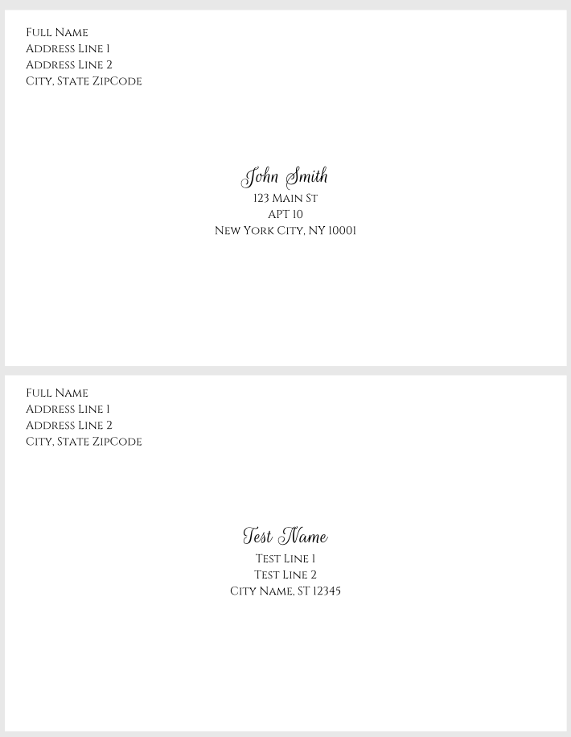

# CSV to PDF Mailing Envelope Converter
This program converts a input CSV file of mailing addresses and generates a single PDF file with one page per address.

## Example CSV input
```csv
Response,Mailing Line 1,Mailing Line 2,City,State,Zip Code
John Smith,123 Main St,APT 10,New York City,NY,10001
Test Name,Test Line 1,Test Line 2,City Name,ST,12345
```

## Example PDF output


## Installation
1. Download & install `wkhtmltopdf`. See https://wkhtmltopdf.org/ for directions.
2. Run `npm install` inside this folder to install node dependencies

## Usage
`npm run convert input.csv output.pdf`

## Configuration
- To edit paper size & CSV column fields, modify `index.js`
- To update design of the page, edit `style.css` file

## Printing tips
- Ensure printer drivers are installed on computer from factory
- Ensure printer has set correct paper size
- Selected the same paper size on the printing preferences

## Troubleshooting
- To debug HTML/CSS formatting issues, open `tmp/output.html` in a web browser
- To debug `wkhtmltopdf` run program directly on `tmp/output.html` to see full output
